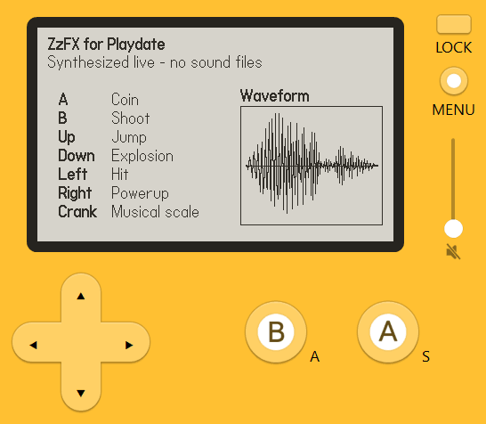

# ZzFX for Playdate

Tiny real-time sound effects for Playdate, powered by ZzFX.

Design a sound in the [ZzFX sound designer](https://killedbyapixel.github.io/ZzFX/),
paste the params into Lua, and play it instantly. No audio asset files needed.

This repo includes a playable demo app.

## Make sounds with the ZzFX editor

Open the ZzFX sound editor:

https://killedbyapixel.github.io/ZzFX/

Quick workflow:

1. Build a sound in the editor.
2. Select the Lua radio button.
3. Copy the generated Lua-style output.
4. Paste it directly into your Lua code.

## Quick start

```lua
import "zzfx"

-- Coin
zzfx({nil,0,988,nil,nil,.4,nil,33,nil,nil,331,.1})

-- Simple beep
zzfx({nil, nil, 220})

-- Note helper
local f = zzfxGetNote(7, 220)
zzfx({nil, nil, f, nil, .04, .12})
```

The editor's Lua output is ready to paste as-is — it already uses `nil` for
empty slots. (If you copy the JS output instead, replace each empty `,,` slot
with `nil`.)

## Build

Requires the [Playdate SDK](https://play.date/dev/) with `PLAYDATE_SDK_PATH` set.
Building for **device** additionally needs the
[Arm GNU Toolchain](https://developer.arm.com/downloads/-/arm-gnu-toolchain-downloads)
(`arm-none-eabi`).

**macOS / Linux / MinGW:**

```bash
make            # Simulator -> ZzFX.pdx
make device     # Device build (needs arm-none-eabi-gcc)
```

**Windows:**

```powershell
$env:PLAYDATE_SDK_PATH = "C:\Program Files (x86)\Playdate"
# Simulator only:
cmake -S . -B build -G "Visual Studio 17 2022"
cmake --build build --config Release
# Simulator + device, bundled into ZzFX.pdx (edit the toolchain paths inside first):
powershell -ExecutionPolicy Bypass -File build.ps1
```

> **Note:** a simulator-only build produces a `.pdx` with no ARM binary — it runs
> in the Simulator but crashes on hardware. Use `make device` / `build.ps1` for the
> device build.

Open `ZzFX.pdx` in the Simulator, or upload to hardware from its Device menu.

## Use it in your own project

Copy `Source/zzfx.lua` plus the `src/` C files (`zzfx.c`, `zzfx.h`, `main.c`)
into your Playdate project, build it (the synth is C, so the toolchain above is
required), then `import "zzfx"` and call `zzfx({...})`.

`Source/` is the Lua/assets folder the SDK builds; `src/` is the native C synth —
the normal split for a mixed Lua + C Playdate project.

## API

- `zzfx(paramsTable)` plays one sound from ZzFX-style params (21-slot array format).
- `zzfxSound(paramsTable, randomness?)` creates a cached sound object.
- Create cached `zzfxSound` objects at startup and reuse them during gameplay.
- `sound:play(pitch?, randomnessScale?)` plays the cached sound.
- `sound:playNote(semitoneOffset?)` plays the cached sound as a note.
- `sound:free()` releases cached sample memory.
- `zzfxGetNote(semitoneOffset, rootFrequency)` returns note frequency.
- C API is available in `src/zzfx.h` (`zzfx_init`, `zzfx_register_lua`, `zzfx_play`).

## Demo

A = Coin, B = Laser, Up = Jump, Down = Explosion, Left = Hit,
Right = Powerup, Crank = musical scale.


